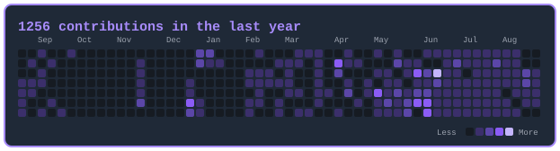
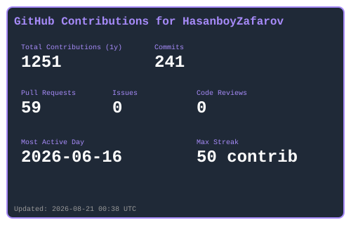
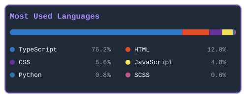

<div align="center">


<br/>

<a href="https://linkedin.com/in/hasanboyzafarov"></a>
<a href="https://t.me/HasanboyZafarov"></a>
<a href="https://github.com/HasanboyZafarov"></a>


</div>

<br/>

## 👤 &nbsp;About Me

```ts
const hasanboy = {
  role:     "Software Front-end Engineer",
  focus:    ["React.js", "TypeScript", "Modern UI patterns"],
  studying: "Cybersecurity @ TUIT Nukus Branch",
  mindset:  "Clean, scalable, maintainable — not just what works",
  offDuty:  ["♟️ Chess", "🧩 Problem solving", "📚 Learning"],
  goal:     "Build world-class products as a Senior Front-end Engineer",
} as const;
```

<div align="center">

| 🎯 &nbsp;Right now | 🌱 &nbsp;Learning | 🚀 &nbsp;Heading toward |
| :--: | :--: | :--: |
| Shipping polished React interfaces | Advanced React patterns & performance | Senior Front-end Engineer |

</div>

<br/>

## 🛠️ &nbsp;Tech Stack

<div align="center">
<table>
<tr>
<td align="center" width="33%">

**Languages & Markup**


</td>
<td align="center" width="34%">

**Frameworks & Tools**


</td>
<td align="center" width="33%">

**Developer Tools**


</td>
</tr>
</table>
</div>

<br/>

## 🎯 &nbsp;Core Competencies

<table>
<tr>
<td width="50%" valign="top">

#### ⚛️ React
Hooks · Context API · performance optimization · component patterns

</td>
<td width="50%" valign="top">

#### 🎨 UI/UX Implementation
Figma → Code · responsive layouts · accessibility

</td>
</tr>
<tr>
<td width="50%" valign="top">

#### 📦 State Management
Zustand · custom hooks · predictable data flow

</td>
<td width="50%" valign="top">

#### 🎭 Styling
Tailwind CSS · SCSS · CSS-in-JS · design systems

</td>
</tr>
</table>

<br/>

## 📊 &nbsp;GitHub Stats

<div align="center">



<br/><br/>




<br/>

<!-- STATS:START -->
📦 All Repos: 57  |  🔒 Private: 29  |  🌐 Public: 28
<!-- STATS:END -->

<sub>All cards above are generated from the GitHub API and refreshed daily by <a href="./.github/workflows/generate-stats.yml">GitHub Actions</a> — no third-party services.</sub>

</div>

<br/>

## 📬 &nbsp;Connect With Me

<div align="center">

<a href="https://linkedin.com/in/hasanboyzafarov"></a>
<a href="https://t.me/HasanboyZafarov"></a>

<br/><br/>

> ### *"Consistency beats intensity. 1% better every day."* 💪


</div>
